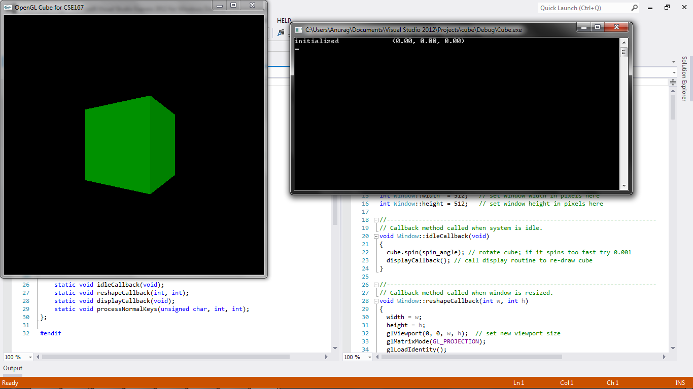

CSE 167 - Introduction to Computer Graphics
Project 1: Cube
====

(See full project specifications here: http://ivl.calit2.net/wiki/index.php/Project1Fall13)

Renders a spinning cube that can be translated, rotated, or scaled with the following controls:

* 'c': Reverse the direction of the spin.
* 'x'/'X': Move cube left/right by a small amount.
* 'y'/'Y': Move cube down/up by a small amount.
* 'z'/'Z': Move cube into/out of the screen by a small amount.
* 'r': Reset cube position, orientation, size and color.
* With every key press, display the new cube position with your Vector3 print method in the text window.
* 'a'/'A': Rotate cube about the OpenGL window's z axis by a small number of degrees (e.g., 10) per key press, counterclockwise ('a') or clockwise ('A'). The z axis crosses the screen in the center of the OpenGL window. This rotation should not affect the spin other than that it will rotate the spin axis with the cube.
* 's'/'S': Scale cube down/up (about its center, not the center of the screen). To scale up means to make it bigger
* '1','2','3','4': Change the color of the cube's faces to red, green, blue, or yellow, respectively

